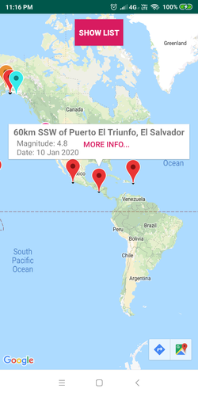

# EarthQuake Watcher Application (Android)

This app monitors real time earthquake with APIs from [https://earthquake.usgs.gov](https://earthquake.usgs.gov/earthquakes/feed/v1.0/geojson.php).

1. List all recent earth quakes.
1. Use google maps API.
1. Pin the earth quakes on the map

## Screenshots

|  |  |  |
|---|---|---|
| Custom info bar | list view | more detail view |
|  |  |  |
| multiple colors | multiple colors | danger zone in red |

